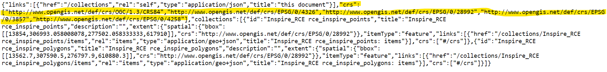

## Examples of Dutch testbed implementations

To test whether INSPIRE requirements can be met with the existing tooling, Geonovum examined 4 Dutch example implementations on testbeds.
1. GOAF implementation from PDOK
2. Pygeoapi implementation on the testbed at Geonovum
3. Geoserver implementation on the testbed at Geonovum
4. GISspecialisten implementation

These examples will be described below. 
Next chapter will give an overview, how these implementations meet the requirements for INSPIRE.

|   example | Stakeholder | used tool | data | landing page|
|-----------|-------------|-----------|------|-------------| 
|  GOAF     |[Dutch Kadaster](https://www.kadaster.nl) and [PDOK](http://www.pdok.nl) | [GOAF](https://github.com/PDOK/goaf) based on Go and PostgreSQL/Postgis| As-is dataset of Dutch addresses in csv format. |https://api.pdok.nl/geonovum/oaf/v1_0|
| Pygeoapi  |[Statistics Netherlands](https://www.cbs.nl/)|[Pygeoapi](https://pygeoapi.io/) |WFS of the INSPIRE harmonized dataset for [Statistical Units](https://www.nationaalgeoregister.nl/geonetwork/srv/dut/catalog.search#/metadata/e08079df-6c19-486e-916e-5c9948cfafea). |https://apisandbox.geonovum.nl/pygeoapi_SU|
|Geoserver  |[Statistics Netherlands](https://www.cbs.nl/)| [Geocat Bridge plugin in QGIS](https://plugins.qgis.org/plugins/geocatbridge/)|same as in Pygeoapi|https://apisandbox.geonovum.nl/geoserver/nl_su_nuts/ogc/features|
|GISspecialisten.nl|[RCE](https://www.cultureelerfgoed.nl/) |Self developed by [GISspecialisten.nl](https://www.gisspecialisten.nl/)|[INSPIRE protected sites](https://www.nationaalgeoregister.nl/geonetwork/srv/dut/catalog.search;jsessionid=8F7125E8DE957788ED181DE50F0A24DB#/metadata/493ab81b-75f8-4205-b030-6b2fd9eb4295) |https://geoservice-ogc-api.azurewebsites.net|

The GOAF implementation has been realized during one week of close cooperation between PDOK and Geonovum in a so called HIGH5 session.
The Dutch addresses used with Goaf implementation were mapped to GeoJSON with OGR modules in Goaf. This dataset was chosen because a description of the GeoJSON encoding was already available at [[PUB-4]].
The harmonized data was not chosen, because it did not contain the actual addresses, but only a link. This is caused by the complexity of the INSPIRE model.  
The Statistical Units used with Pygeoapi and Geoserver were chosen, because the harmonized WFS returns simple GML, so problems with complex GML could be avoided.  
The GISspecialisten example was created for a tender to implement [spatial API's in a testbed](https://github.com/Geonovum/testbed-spatial-APIs) dealing with 5 research topics. This one is the result of [Topic one](https://github.com/Geonovum/testbed-spatial-APIs/tree/main/topic%20%231%20Spatial%20data%20APIs%20CRS%20Extension), which was about serving more than one CRS.

### Examples versus INSPIRE requirements

Next table shows in what extent the examples meet the INSPIRE requirements for OAPIF.

|nr| Requirement| GOAF	| Pygeoapi|	Geoserver| GISspecialisten|
|---|-------|-------------|-----------|------|-------| 
|1|OGC API Features Core| 95%	|95%	|90%	|95%|
|3|multilinguality|?|?|?|?|
|4|predefined download| 50|	66%|	0%|	0%|
|5|GeoJSON| 100%|	100%|	100%|	100%|
|6|bulk download| 100%|	100%|	0%|	0%|
|7|CRS ETRS89 and WGS84 (OGC API Features part 2)|	0%|	0%|	90%|	90%|
|8a|INSPIRE validated GML as input|	0%|	10%|	50%|	0%|
|8b|INSPIRE validated GML as output| 0%|	0%|	0%|	0%|
|9|Dutch API design rules|65%|	65%|	65%|	65%|
|10|describing encoding|100%|	100%|	0%|	0%|
|11|filtering|40%|	60%|	60%|	20%|
|12|metadata links|50%|	100%|	0%|	0%|

The numbers correspond to the numbers used in the chapter on [requirements](#H02).
Requirement [2](#inpsire-mif-document-setting-up-an-inspire-download-service-based-on-the-ogc-api-features-standard) is covered by numbers 3 till 7 and 12.
The multilinguallity, has not been regarded, since it is not a big issue in the Netherlands.
Per tool, these findings are elaborated in the next chapters when relevant.

#### GOAF versus INSPIRE requirements

The following findings were encountered during the test at the Geonovum testbed for OGC-API-Features with GOAF.

***RQ 1:OGC API Features Core***  
The INSPIRE validator gave one error on the bbox parameter, although it seems to work fine:
https://api.pdok.nl/geonovum/oaf/v1_0/collections/addresses/items?f=json&bbox=4.87327047393363,53.08348503147304,4.87328,53.08349 returns 4 items instead of 100

***RQ 4:predefined download***  
There is a link to the metadata for the one collection addresses in the OAPIF.  
There is no link to http://inspire.ec.europa.eu/featureconcept/Address, but in fact this concerns the not harmonized data.  
The licence link is missing.

***RQ 5:GeoJSON***  
The output encoding for GeoJSON is supported: http://api.pdok.nl/geonovum/oaf/v1_0/collections/addresses//items?f=json

***RQ 6:bulk download***  
The bulk download has been implemented via the existing Atom feed download services : https://api.pdok.nl/geonovum/oaf/v1_0/collections?f=html with
https://geodata.nationaalgeoregister.nl/inspireadressen/extract/inspireadressen.zip, which contains the INSPIRE harmonized GML.  
Additionally, there is a geopackage link (https://s3.delivery.pdok.nl/public/geonovum/addresses.gpkg), but that is not required for INSPIRE.

***RQ 7:CRS ETRS89 and WGS84***  
Only coordinate reference system  [WGS84](https://epsg.io/4326) is implemented.
 
***RQ 8a:GML as input***  
In the case of the Dutch addresses the choice has finally been made, not to use the harmonized GML as input. Instead, the AS-Is-data was chosen, because in this harmonized GML file, the addresses don't contain the actual address, but links to sub elements via the components tag. As a result of this choice, the Inspire-ID is missing because that was no part of the AS-Is data.

***RQ 8b:GML as output***  
GML as output is not supported.

***RQ 9:Dutch API design rules***  
Not all requirements from [Dutch API design rules](https://www.geonovum.nl/over-geonovum/actueel/rest-api-design-rules-op-pas-toe-leg-uit-lijst) have been implemented:
1. no 404 result when "/" was used on the end of an URL: (https://publicatie.centrumvoorstandaarden.nl/api/adr/#api-48)
2. no complete version number in every return: (https://publicatie.centrumvoorstandaarden.nl/api/adr/#api-57).

***RQ 10:describing encoding***  
The describing of the encoding has been referred to via https://api.pdok.nl/geonovum/oaf/v1_0/collections?f=html with:
https://github.com/INSPIRE-MIF/2017.2/blob/master/GeoJSON/ads/simple-addresses.md#model-mapping.

***RQ 11:filtering***  
For implementing filters, the bbox and items options have been implemented. A next step would be filtering on values of the attributes. 
For that, it would be needed to get an overview of the attributes with https://api.pdok.nl/geonovum/oaf/v1_0/collections/addresses/queryables?f=html.

***RQ 12:metadata links***  
1. Metadata link of the dataset has been implemented via https://api.pdok.nl/geonovum/oaf/v1_0/collections?f=html with: https://www.nationaalgeoregister.nl/geonetwork/srv/dut/xml.metadata.get?uuid=a5f961e9-ebdd-41e2-b8e8-ab33ed340a83 .
2. The metadata of the services were not implemented, but could be copied from the WFS metadata with some slight adjustments.
3. Metadata of the service could also be obtained from: https://api.pdok.nl/geonovum/oaf/v1_0/api?f=html.

***Other findings***  
1. The GOAF implementation has given a lot of insight for PDOK for future implementations of INSPIRE OAPIF for their data providers.
2. More technical findings and issues can be found [here](https://github.com/PDOK/goaf/issues).
3. The data provider (Kadaster) was happy with the overview the collection request gave.
4. PDOK has mainly focussed on the OGC API Features Core part 1 [[PUB-1]]. A next step would be to focus on part 2 (CRS) [[PUB-5]] and 3 (filtering) [[PUB-6]].
5. PDOK prefers flattened data as input in geopackages, so the data providers must do this flattening and conversion to geopackage by themself.

***Possible improvements***  
The following improvements could still be made:

1. implementation of [ETRS89](https://epsg.io/4258) should be considered first, because this is the one used within INSPIRE. PDOK would do the transformation to ETRS89 in advance and serve two datasets. The alternative, transforming on the fly, would probably not perform well.
2. adding the INSPIRE ID to the used dataset,
3. give a result for https://api.pdok.nl/geonovum/oaf/v1_0/collections/addresses/queryables?f=html to show all attributes and make it possible to filter on their values,
4. implement filters other than bbox and items,
5. metadata of the service and link to the service in the metadata of the dataset.
6. add a licence link.

#### Pygeoapi versus INSPIRE requirements

The following findings were encountered during the test at the Geonovum testbed for OGC-API-Features with Pygeoapi.

***RQ 1:OGC API Features Core***  
The INSPIRE validator gave one error on the definition of the API, although it is available via https://apisandbox.geonovum.nl/pygeoapi_SU/openapi 

***RQ 4:predefined download***  
There is a link to the metadata of the dataset for the collections to the Statistical Units dataset in the OAPIF.  
There is a link to the featureconcept metadata of the dataset: https://inspire.ec.europa.eu/featureconcept/VectorStatisticalUnit.  
The licence link is missing.

***RQ 5:GeoJSON***  
The source encoding used was the GML as resulted from the WFS request mentioned above. It was converted into geopackage via QGIS v3.16. which then was input to Pygeoapi.
Since the WFS results in simple GML the mapping was an easy 1 to 1 mapping. The conversion to the output in GeoJSON was an automated process within Pygeoapi.

***RQ 6:bulk download***  
The bulk download links to the WFS of the harmonized dataset:  
https://geodata.nationaalgeoregister.nl/su-vector/wfs?request=GetFeature&version=2.0.0&typeNames=su-vector:SU.VectorStatisticalUnit&filter=%3CFilter+xmlns=%22http://www.opengis.net/ogc%22%3E%3CPropertyIsEqualTo%3E%3CPropertyName%3Etessellation_localid%3C/PropertyName%3E%3CLiteral%3Egemeente.2018%3C/Literal%3E%3C/PropertyIsEqualTo%3E%3C/Filter%3E

***RQ 7:CRS ETRS89 and WGS84***  
The source data from the WFS was in [ETRS89](https://epsg.io/4258).
Pygeoapi does have the option to specify the source_srs and target_srs, but it is not used yet because the output appears to be [WGS84](https://epsg.io/4326) regardless of the specified target_srs. 

***RQ 8:GML***  
1. Pygeoapi supports direct WFS and Simple GML as input. Unfortunately this did not work, as you can see on the 2 collections where is was tried: https://apisandbox.geonovum.nl/pygeoapi_SU/collections/StatisticalUnits_Gemeente_2017/items and https://apisandbox.geonovum.nl/pygeoapi_SU/collections/StatisticalUnits_Gemeente_2016_GML/items.
2. Output as GML is not possible within Pygeoapi. 

***RQ 9:Dutch API design rules***  
Not all requirements from [Dutch API design rules](https://www.geonovum.nl/over-geonovum/actueel/rest-api-design-rules-op-pas-toe-leg-uit-lijst) have been implemented:
1. no 404 result when "/" was used on the end of an URL: (https://publicatie.centrumvoorstandaarden.nl/api/adr/#api-48)
2. no version number in URL: https://publicatie.centrumvoorstandaarden.nl/api/adr/#api-20
3. no complete version number in every return: https://publicatie.centrumvoorstandaarden.nl/api/adr/#api-57

***RQ 10:describing encoding***  
The describing of the encoding has not been performed, but in fact it is a simple 1 to 1 conversion.

***RQ 11:filtering***  
For implementing filters, the bbox and items options were implemented. Next to that, one can filter on the attributes which can be retrieved from:
https://apisandbox.geonovum.nl/pygeoapi_SU/collections/StatisticalUnits_Gemeente_2018/queryables.
The specification for filtering [[PUB-6]] does not yet have the status "approved" and has not yet been considered.

***RQ 12:metadata links***  
1. Metadata link of the dataset was not difficult to implement, because we easily referred to it via https://apisandbox.geonovum.nl/pygeoapi_SU/collections/StatisticalUnits_Gemeente_2018 with:
https://www.nationaalgeoregister.nl/geonetwork/srv/dut/catalog.search#/metadata/10d1153e-778f-4995-9b6c-7c69b196cccb.  It still needs adjustment, for adding the OAPIF to the download links. A new protocol needs to be added to the code list for this. (https://inspire.ec.europa.eu/metadata-codelist/ProtocolValue:1). 
As long as it is not there, the Dutch profile for metadata can be used with the value: "OGC:API features" https://geonovum.github.io/Metadata-ISO19119/#codelist-protocol.
2. The metadata of the services were not implemented, but could be copied from the WFS metadata with some slight adjustments.
3. Metadata of the service could also be obtained from: https://apisandbox.geonovum.nl/pygeoapi_SU.

***Other findings***  
1. OAPIF is more suitable for Statistical Units than WFS 2.0, because the collections make it easier to separate the different SU types.
2. In QGIS 3.16, the implemented OAPIF at Pygeoapi performs slower than WFS 2.0 (15 seconds versus 3 seconds for Dutch communities). This is probably due to QGIS, because in the browser Pygeoapi performs much faster.

***Possible improvements***  
The following improvements could still be made:

1. implementation of ETRS89 as output CRS conform [[PUB-5]]
2. metadata of the service and link to the service in the metadata of the dataset
3. test direct WFS or GML input into Pygeoapi
4. link to the license
5. testing with more complex INSPIRE themes than Statistical Units
6. adjust to the Dutch API design rules

#### Geoserver versus INSPIRE requirements

Based on the geoserver implementation on the Geonovum testbed, it was possible to publish two layers from Statistical Units as OAPIF.
The Geocat Bridge plugin in QGIS was used for this. The result is a two-layer OAPIF:
https://apisandbox.geonovum.nl/geoserver/nl_su_nuts/ogc/features/collections/
The following findings were encountered during the test at the Geonovum testbed for OGC-API-Features with Geoserver via Geocat Bridge.

***RQ 1:OGC API Features Core***  
The INSPIRE validator gave one error on the response of the filters, links and featureID

***RQ 4:predefined download***  
There is no link to the metadata of the dataset.  
There is no link to the featureconcept metadata of the dataset.  
The licence link is missing.

***RQ 5:GeoJSON***  
The source encoding used was the GML as resulted from the WFS request mentioned above. It was converted into geopackage via QGIS v3.16. which was input to Geoserver via Geocat Bridge.
The conversion to the output in GeoJSON was an automated process within Geoserver.

***RQ 6:bulk download***  
The was no bulk download link. 

***RQ 7:CRS ETRS89 and WGS84***  
https://apisandbox.geonovum.nl/geoserver/nl_su_nuts/ogc/features/collections/su_nuts1_2016_RDNew?f=application%2Fjson
clearly shows that multiple CRSs are supported.
The items can be retrieved with multiple CRS's as output.  
Compare in RD New:
https://apisandbox.geonovum.nl/geoserver/nl_su_nuts/ogc/features/collections/su_nuts1_2016_RDNew/items?f=application%2Fgeo%2Bjson&crs=http://www.opengis.net/def/crs/EPSG/0/28992/  
with ETRS89:
https://apisandbox.geonovum.nl/geoserver/nl_su_nuts/ogc/features/collections/su_nuts1_2016_RDNew/items?f=application%2Fgeo%2Bjson&crs=http://www.opengis.net/def/crs/EPSG/0/4258/

Regarding to OGC-API-Features specification part 2 [[PUB-5]], 4 requirements were not met:
- [Requirement 3 and 4](http://docs.opengeospatial.org/is/18-058/18-058.html#_storage_crs) concern the Storage CRS which could not be found in the description of the collection object.
- [Requirement 15 and 16](http://docs.opengeospatial.org/is/18-058/18-058.html#_coordinate_reference_system_information_independent_of_the_feature_encoding) concern the use of a Content-CRS header where Geoserver uses a OGC-CRS header.

***RQ 8:GML***  
1. Since the input was from a WFS, the input originally was GML encoded. It was converted into geopackage via QGIS v3.16. which then was input to Geoserver via Geocat Bridge.
2. Output as GML is not possible within Geoserver via OAPIF. But Geoserver does automatically create a comparable OGC-WFS which does support GML as output. 

***RQ 9:Dutch API design rules***  
Not all requirements from the [Dutch API design rules](https://www.geonovum.nl/over-geonovum/actueel/rest-api-design-rules-op-pas-toe-leg-uit-lijst) have been implemented:
1. no 404 result when "/" was used on the end of an URL: (https://publicatie.centrumvoorstandaarden.nl/api/adr/#api-48)
2. no version number in URL: https://publicatie.centrumvoorstandaarden.nl/api/adr/#api-20
3. no complete version number in every return: https://publicatie.centrumvoorstandaarden.nl/api/adr/#api-57
4. no use of the standard naming of the OAS document ('api' was used instead of 'openapi') https://publicatie.centrumvoorstandaarden.nl/api/adr/#api-51

***RQ 10:describing encoding***  
The describing of the encoding has not been performed, but in fact it is a simple 1 to 1 conversion.
But, if there had been a description of how the encoding relates to the concerned INSPIRE data model, it would not have been possible to link to it.

***RQ 11:filtering***  
For implementing filters, the bbox and items options were implemented. Next to that, one can filter on the attributes which can be retrieved from:
https://apisandbox.geonovum.nl/geoserver/nl_su_nuts/ogc/features/collections/su_nuts1_2016_RDNew/queryables.  
The specification for filtering [[PUB-6]] does not yet have the status "approved" and has not yet been considered.

***RQ 12:metadata links***  
1. There was no option for a link to the metadata. 
2. The metadata of the services were not implemented, but could be copied from the WFS metadata with some slight adjustments: https://apisandbox.geonovum.nl/geoserver/nl_su_nuts/su_nuts1_2016_RDNew/wfs?request=GetCapabilities
3. Metadata of the service could also be obtained from: https://apisandbox.geonovum.nl/geoserver/nl_su_nuts/ogc/features/api.

***Other findings***  
1. One big drawback sofar for Geosever (version 2.19.1) is that links to the metadata, bulk download or license were not included in the [list of links](https://apisandbox.geonovum.nl/geoserver/nl_su_nuts/ogc/features/collections/su_nuts1_2016_RDNew?f=application%2Fjson).
2. Based on a small inquiry, Geoserver appears to be the most used tooling for INSPIRE OAPIF in Europe. So, it is strange that relatively simple INSPIRE requirement for linking to metadata, bulk download and license are not implemented.
3. The status of Geoserver in relation to OGC specifications can be found at: https://docs.geoserver.org/stable/en/user/community/ogc-api/features/index.html

***Possible improvements***  
The following improvements could still be made:

1. link to metadata of the dataset
2. link to bulk download
3. link to encoding description
4. link to the license
5. Geoserver has good support for multiple CRS's, but could still adjust more to OGC-API-Features specification part 2 [[PUB-5]]
6. testing with more complex INSPIRE themes than Statistical Units
7. adjust to the Dutch API design rules

#### GISspecialisten.nl versus INSPIRE requirements

Another example of using more than one CRS as output for the OAPIF is the result of the company GISspecialisten:  
https://geoservice-ogc-api.azurewebsites.net/  
This Implementation had its focus mainly on serving more than one CRS, so that explains why not all requirements were met.
GISspecialisten has promised to keep this test implementation live 1 year after implementation which was the end of 2021.

***RQ 1:OGC API Features Core***  
The INSPIRE validator gave one error on the definition of the API, although it is available via https://geoservice-ogc-api.azurewebsites.net/api/

***RQ 4:predefined download***  
There is no link to the metadata of the dataset.  
There is no link to the featureconcept metadata of the dataset.  
The licence link is missing.

***RQ 5:GeoJSON***  
The source encoding used, was the geopackage that could be downloaded via the INSPIRE Atom feed of the dataset "geharmoniseerde Beschermde Gebieden - Cultuur Historie".
This Atom feed can be found via the metadata:  
https://www.nationaalgeoregister.nl/geonetwork/srv/dut/catalog.search;jsessionid=8F7125E8DE957788ED181DE50F0A24DB#/metadata/493ab81b-75f8-4205-b030-6b2fd9eb4295
  
In QGIS, the geopackage was converted to PostgreSQL SQL database, which was the basis for the tool serving the OAPIF.
The output was converted by this tool to GeoJson:
https://geoservice-ogc-api.azurewebsites.net/collections/Inspire_RCE%20rce_inspire_polygons/items?limit=2

Interesting aspect is the use of JSON-FG as alternative format:
https://geoservice-ogc-api.azurewebsites.net/collections/Inspire_RCE%20rce_inspire_polygons/items?format=JSON-FG&limit=2  

***RQ 6:bulk download***  
The bulk download link has not been implemented. 

***RQ 7:CRS ETRS89 and WGS84***  

https://geoservice-ogc-api.azurewebsites.net/collections/ gives the following result:

This shows that multiple CRS's are supported.
The items can be retrieved with multiple CRS's as output. 
Compare in RD New:  
https://geoservice-ogc-api.azurewebsites.net/collections/Inspire_RCE%20rce_inspire_points/items/59631/?crs=http://www.opengis.net/def/crs/EPSG/0/28992  

with ETRS89:  
https://geoservice-ogc-api.azurewebsites.net/collections/Inspire_RCE%20rce_inspire_points/items/59631/?crs=http://www.opengis.net/def/crs/EPSG/0/4258 

Regarding to OGC-API-Features specification part 2 [[PUB-5]], 2 related [Requirements 3 and 4](http://docs.opengeospatial.org/is/18-058/18-058.html#_storage_crs) were not met. They concern the Storage CRS which could not be found in the description of the collection object.

***RQ 8:GML***  
1. The application only works with a PostgreSQL SQL database, so no GML as input.
2. Output as GML is not possible. 

***RQ 9:Dutch API design rules***  
Not all requirements from [Dutch API design rules](https://www.geonovum.nl/over-geonovum/actueel/rest-api-design-rules-op-pas-toe-leg-uit-lijst) have been implemented:
1. no 404 result when "/" was used on the end of an URL: (https://publicatie.centrumvoorstandaarden.nl/api/adr/#api-48)
2. no version number in URL: https://publicatie.centrumvoorstandaarden.nl/api/adr/#api-20
3. no complete version number in every return: https://publicatie.centrumvoorstandaarden.nl/api/adr/#api-57
4. no use of the standard naming of the OAS document ('api' was used instead of 'openapi') https://publicatie.centrumvoorstandaarden.nl/api/adr/#api-51

***RQ 10:describing encoding***  
The describing of the encoding has not been performed. 

***RQ 11:filtering***  
For implementing filters, the bbox and items options were implemented.
The specification for filtering [[PUB-6]] does not yet have the status "approved" and has not yet been considered.

***RQ 12:metadata links***  
1. There was no option for a link to the metadata. 
2. The metadata of the services were not implemented
3. Metadata of the service could also be obtained from: https://geoservice-ogc-api.azurewebsites.net/api/.

***Other findings***  
1. Interesting aspect is the use of JSON-FG as alternative format:
https://geoservice-ogc-api.azurewebsites.net/collections/Inspire_RCE%20rce_inspire_polygons/items?format=JSON-FG&limit=2  
2. The final result of this Pilot has been published on:
https://github.com/Geonovum/testbed-spatial-APIs/tree/main/topic%20%231%20Spatial%20data%20APIs%20CRS%20Extension   

***Possible improvements***  
The following improvements could be made, although it was not the intention of this example to make a fully compliant implementation:

1. link to metadata of the dataset
2. link to bulk download
3. link to encoding description
4. link to the license
5. the GISspecialisten tool has good support for multiple CRS's, but could still adjust more to OGC-API-Features specification part 2 [[PUB-5]]
6. adjust to the Dutch API design rules
7. give a result for https://geoservice-ogc-api.azurewebsites.net/collections/queryables to show all attributes and make it possible to filter on their values.

### General findings

1. The protocol element in the metadata is based on a code list. A new protocol needs to be added to this list of [protocol values]https://inspire.ec.europa.eu/metadata-codelist/ProtocolValue:1). As long as it is not there, the Dutch profile for metadata can be used with the value: "OGC:API features" https://geonovum.github.io/Metadata-ISO19119/#codelist-protocol.
2. Much time is needed for flattening of the data and the associated description of the encoding to alternative simple encodings in relation to the INSPIRE data models. A centralized EU approach is needed.
3. Current tooling (server and client) does not yet fully support another CRS than WGS84 according to the currently accepted specification part 2 [[PUB-5]]. Geoserver and the example of GISspecialisten came close to this specification. Also, the extension of the GeoJSON (Json FG) standard for another CRS which is in development, might help in this issue.
5. Another blocking issue before implementation of the OAPIF for INSPIRE is that descriptions of encodings other than GML are not yet available for most INSPIRE themes.
6. Complex GML as input and output are difficult as long as tooling (server and client) expects simple encodings.
7. One could discuss if it is useful to publish complex GML as output, because it is not in line with the aim of OGI API Features: easy to use for developers.
8. Complex GML as input needs a flattening of the data. This is needed for the software that publishes the features. It can only work with simple features, with one value per attribute and without relations to other objects. This is often not the case with the more complex INSPIRE models.

### Resulting documentation

Documentation like presentations can be found here: https://github.com/Geonovum/OAPIF-PDOK-INSPIRE/tree/main/docs
