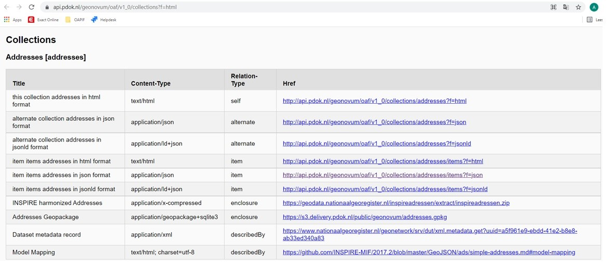
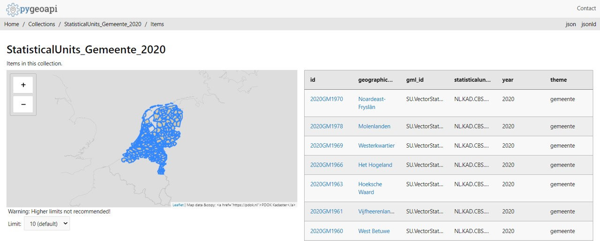

## Results

The results and findings are listed below for the High5 session with PDOK and the testbed at Geonovum.
The results and findings are listed per requirement (RQ).

### Resulting findings High5 with PDOK

The following findings were encountered during the High5 session with PDOK.

#### RQ 1 and 2: OGC API Features Core and INSPIRE-MIF document for High5 PDOK

These requirements are too general to mention findings.

#### RQ 3:Multilinguality for High5 PDOK

Multilinguality is not a relevant issue for the Dutch situation, but might be of more interest to other countries.

#### RQ 4:predefined download for High5 PDOK

In this case predefined download is considered the same as the bulk download (requirement 6), but it could also be a subset.
Predefined download was not difficult to implement, because we easily referred to the existing Atom feed download services via https://api.pdok.nl/geonovum/oaf/v1_0/collections?f=html with
https://geodata.nationaalgeoregister.nl/inspireadressen/extract/inspireadressen.zip, which contains the INSPIRE harmonized GML.
Additionally there is a geopackage link (https://s3.delivery.pdok.nl/public/geonovum/addresses.gpkg), but that is not required for INSPIRE.

#### RQ 5:GeoJSON for High5 PDOK

1. It was expected that much time would be needed for the mapping to GeoJSON if this mapping was not available. This was one of the reasons for using addresses, because for this theme, this work had already been done: https://github.com/INSPIRE-MIF/2017.2/blob/master/GeoJSON/ads
2. We need a centralized establishment of GeoJSON schema's for all the INSPIRE feature types, otherwise member states will all do this in their own way and we will never reach the goal of INSPIRE to be able to do cross boarder mapping.
3. We could consider leaving out the empty fields, or use an option not to show them.

#### RQ 6:bulk download for High5 PDOK

In this case, the bulk download requirement, is considered the same as the one for predefined download, but that is not always the case as stated in requirement 4.  

#### RQ 7:CRS ETRS89 and WGS84 for High5 PDOK

Only coordinate reference system  [WGS84](https://epsg.io/4326) was implemented, because there was no time for another CRS. If time is available, [ETRS89](https://epsg.io/4258) should be considered first, because this is the one used within INSPIRE.
PDOK would do the transformation in advance and serve two datasets to improve the interoperability. The alternative, transforming on the fly, would probably not perform well.

#### RQ 8:GML for High5 PDOK

1. Complex GML as output is difficult and would not be realistic in the time available for this research. It was there for not implemented. One could also discuss if it is really useful, because it is not in line with the aim of OGI API Features: easy to use for developers.
2. Complex GML as input needs a flattening of the data. This is needed for the software that publishes the features. It can only work with simple features, with one value per attribute and without relations to other objects. This is often not the case with the more complex INSPIRE models.
3. PDOK prefers flattened data as input in geopackages, so the data providers have to do this flattening by themself.
4. In the case of the Dutch addresses the choice has finally been made, not to use the harmonized GML as input, but the AS-Is-data, because in this harmonized GML file, the addresses don't contain the actual address, but links to sub elements via the components tag. As a result of this choice, the Inspire-ID is missing because that was no part of the AS-Is data.

#### RQ 9:Dutch API design rules for High5 PDOK

Not all requirements from [Dutch API design rules](https://www.geonovum.nl/over-geonovum/actueel/rest-api-design-rules-op-pas-toe-leg-uit-lijst) were implemented:
1. no 404 result when "/" was used on the end of an URL: (https://publicatie.centrumvoorstandaarden.nl/api/adr/#api-48)
2. no complete version number in every return: (https://publicatie.centrumvoorstandaarden.nl/api/adr/#api-57).

#### RQ 10:describing encoding for High5 PDOK

The describing of the encoding was not difficult to implement, because we easily referred to it via https://api.pdok.nl/geonovum/oaf/v1_0/collections?f=html with:
https://github.com/INSPIRE-MIF/2017.2/blob/master/GeoJSON/ads/simple-addresses.md#model-mapping.
	
#### RQ 11:filtering for High5 PDOK

For implementing filters, the bbox and items options were implemented. A next step would be filtering on values of the attributes. 
For that it would be needed to get an overview of the attributes with https://api.pdok.nl/geonovum/oaf/v1_0/collections/addresses/queryables?f=html.
The specification for filtering [[PUB-6]] does not yet have the status "approved" and has not yet been taken into account.

#### RQ 12:metadata links for High5 PDOK

1. Metadata link of the dataset was not difficult to implement, because we easily referred to it via https://api.pdok.nl/geonovum/oaf/v1_0/collections?f=html with:
https://www.nationaalgeoregister.nl/geonetwork/srv/dut/xml.metadata.get?uuid=a5f961e9-ebdd-41e2-b8e8-ab33ed340a83 . It still needs adjustment, for adding the OAPIF to the download links. A new protocol needs to be added to the code list for this. (https://inspire.ec.europa.eu/metadata-codelist/ProtocolValue:1). 
As long as it is not there, the Dutch profile for metadata can be used with the value: "OGC:API features" https://geonovum.github.io/Metadata-ISO19119/#codelist-protocol.
2. The metadata of the services were not implemented, but could be copied from the WFS metadata with some slight adjustments.
3. Metadata of the service could also be obtained from: https://api.pdok.nl/geonovum/oaf/v1_0/api?f=html.

#### Other findings for High5 PDOK

1. The HIGH5 session has given a lot of insight for PDOK for future implementations of INSPIRE OAPIF for their data providers.
2. More technical findings and issues can be found [here](https://github.com/PDOK/goaf/issues).
3. The data provider (Kadaster) was happy with the overview the collection request gave.
4. PDOK has mainly focussed on the OGC API Features Core part 1 [[PUB-1]]. A next step would be to focus on part 2 (CRS) [[PUB-5]] and 3 (filtering) [[PUB-6]].
5. Another blocking issue before implementation of the OAPIF for INSPIRE at PDOK is that descriptions of encodings are not yet available for most themes.

#### Resulting services for High5 PDOK

The resulting OGC API Feature service can be found via the links listed below.

The root: 
https://api.pdok.nl/geonovum/oaf/v1_0/

The collections:
https://api.pdok.nl/geonovum/oaf/v1_0/collections?f=html

<figure id="Figuur_1">

<figcaption>Result from collection request.</figcaption>
</figure>

The items:
https://api.pdok.nl/geonovum/oaf/v1_0/collections/addresses/items?f=html

#### Possible improvements for High5 PDOK
The following improvements could still be made after the high5 session:

1. implementation of ETRS89 as CRS,
2. adding the INSPIRE ID,
3. give a result for https://api.pdok.nl/geonovum/oaf/v1_0/collections/addresses/queryables?f=html to show all attributes and make it possible to filter on their values,
4. implement filters other than bbox and items,
5. metadata of the service and link to the service in the metadata of the dataset.

### Resulting findings Pygeoapi Geonovum testbed for OGC-API-Features

The following findings were encountered during the test at the Geonovum testbed for OGC-API-Features.
Only new findings compared to the High5 session with PDOK are mentioned.

#### RQ 4:predefined download Pygeoapi testbed Geonovum

In this case predefined download is considered the same as the bulk download (requirement 6), but it could also be a subset.
Predefined download was not difficult to implement, because we referred to the WFS of the harmonized dataset:
https://geodata.nationaalgeoregister.nl/su-vector/wfs?request=GetFeature&version=2.0.0&typeNames=su-vector:SU.VectorStatisticalUnit&filter=%3CFilter+xmlns=%22http://www.opengis.net/ogc%22%3E%3CPropertyIsEqualTo%3E%3CPropertyName%3Etessellation_localid%3C/PropertyName%3E%3CLiteral%3Egemeente.2018%3C/Literal%3E%3C/PropertyIsEqualTo%3E%3C/Filter%3E

#### RQ 5:GeoJSON Pygeoapi testbed Geonovum

The source encoding used was the GML as resulted from the WFS request mentioned above. It was converted into gpkg via QGIS v3.16. which was input to Pygeoapi.
Since the WFS results in simple GML the mapping was an easy 1 to 1 mapping. The conversion to the output in GeoJSON was an automated process within Pygeoapi.

#### RQ 7:CRS ETRS89 and WGS84 Pygeoapi testbed Geonovum

The source data from the WFS was in [ETRS89](https://epsg.io/4258).
Pygeoapi does have the option to specify the source_srs and target_srs, but it is not used yet by clients like QGIS.
Qgis considers the output to be [WGS84](https://epsg.io/4326) regardless of the specified target_srs. 

#### RQ 8:GML Pygeoapi testbed Geonovum

1. Simple GML as input is no problem. In fact we could have skipped the in between step to gpkg because Pygeoapi supports direct WFS input. If it were complex GML this would probably not have been that simple, but this has not yet been tested.
2. Output as GML is not possible within Pygeoapi. 

#### RQ 9:Dutch API design rules Pygeoapi testbed Geonovum

Not all requirements from [Dutch API design rules](https://www.geonovum.nl/over-geonovum/actueel/rest-api-design-rules-op-pas-toe-leg-uit-lijst) were implemented:
1. no 404 result when "/" was used on the end of an URL: (https://publicatie.centrumvoorstandaarden.nl/api/adr/#api-48)
2. no version number in URL: https://publicatie.centrumvoorstandaarden.nl/api/adr/#api-20
3. no complete version number in every return: https://publicatie.centrumvoorstandaarden.nl/api/adr/#api-57
4. singular in stead of plural nouns were used: https://publicatie.centrumvoorstandaarden.nl/api/adr/#api-54

#### RQ 10:describing encoding Pygeoapi testbed Geonovum

The describing of the encoding has not been performed, but in fact it is a simple 1 to 1 conversion.
	
#### RQ 11:filtering Pygeoapi testbed Geonovum

For implementing filters, the bbox and items options were implemented. Next to that, one can filter on the attributes which can be retrieved from:
https://apisandbox.geonovum.nl/pygeoapi_SU/collections/StatisticalUnits_Gemeente_2018/queryables.
The specification for filtering [[PUB-6]] does not yet have the status "approved" and has not yet been taken into account.

#### RQ 12:metadata links Pygeoapi testbed Geonovum

1. Metadata link of the dataset was not difficult to implement, because we easily referred to it via https://apisandbox.geonovum.nl/pygeoapi_SU/collections/StatisticalUnits_Gemeente_2018 with:
https://www.nationaalgeoregister.nl/geonetwork/srv/dut/catalog.search#/metadata/10d1153e-778f-4995-9b6c-7c69b196cccb. It still needs adjustment, for adding the OAPIF to the download links. A new protocol needs to be added to the code list for this. (https://inspire.ec.europa.eu/metadata-codelist/ProtocolValue:1). 
As long as it is not there, the Dutch profile for metadata can be used with the value: "OGC:API features" https://geonovum.github.io/Metadata-ISO19119/#codelist-protocol.
2. The metadata of the services were not implemented, but could be copied from the WFS metadata with some slight adjustments.
3. Metadata of the service could also be obtained from: https://apisandbox.geonovum.nl/pygeoapi_SU.

#### Other findings Pygeoapi testbed Geonovum

1. OAPIF is more suitable for Statistical Units than WFS 2.0, because the collections make it easier to separate the different SU types.
2. In QGIS 3.16, the implemented OAPIF at Pygeoapi performs slower than WFS 2.0 (15 seconds versus 3 seconds for Dutch communities). This is probably due to QGIS, because in the browser Pygeoapi performs much faster.

#### Resulting services Pygeoapi testbed Geonovum

The resulting OGC API Feature service can be found via the links listed below.

The root: 
https://apisandbox.geonovum.nl/pygeoapi_SU

The collections:
https://apisandbox.geonovum.nl/pygeoapi_SU/collections?f=html

The items:
https://apisandbox.geonovum.nl/pygeoapi_SU/collections/StatisticalUnits_Gemeente_2020/items?f=html

<figure id="Figuur_2">

<figcaption>Result from an items request on collection of Dutch communities.</figcaption>
</figure>

#### Possible improvements Pygeoapi testbed Geonovum
The following improvements could still be made:

1. implementation of ETRS89 as output CRS conform [[PUB-5]]
2. using plural instead of singular nouns in the collection names
3. metadata of the service and link to the service in the metadata of the dataset
4. test direct WFS input into Pygeoapi
5. testing with more complex INSPIRE themes than Statistical Units

### Results Geoserver on testbed Geonovum

Based on the geoserver implementation on the Geonovum testbed, it was possible to publish two layers from Statistical Units as OAPIF.
The Geocat Bridge plugin in QGIS was used for this.
The result is a two-layer OAPIF:
https://apisandbox.geonovum.nl/geoserver/nl_su_nuts/ogc/features/collections/

https://apisandbox.geonovum.nl/geoserver/nl_su_nuts/ogc/features/collections/su_nuts1_2016_RDNew?f=application%2Fjson
clearly shows that multiple CRSs are supported.
The items can be retrieved with multiple CRS's as output. 
Compare in RD New:
https://apisandbox.geonovum.nl/geoserver/nl_su_nuts/ogc/features/collections/su_nuts1_2016_RDNew/items?f=application%2Fgeo%2Bjson&crs=http://www.opengis.net/def/crs/EPSG/0/28992/
with ETRS89:
https://apisandbox.geonovum.nl/geoserver/nl_su_nuts/ogc/features/collections/su_nuts1_2016_RDNew/items?f=application%2Fgeo%2Bjson&crs=http://www.opengis.net/def/crs/EPSG/0/4258/

Regarding to OGC-API-Features specification part 2 [[PUB-5]], 4 requirements were not met:
- [Requirement 3 and 4](http://docs.opengeospatial.org/is/18-058/18-058.html#_storage_crs) concern the Storage CRS which could not be found in the description of the collection object.
- [Requirement 15 and 16](http://docs.opengeospatial.org/is/18-058/18-058.html#_coordinate_reference_system_information_independent_of_the_feature_encoding) concern the us of a Content-CRS"header where Geoserver uses a OGC-CRS header.

One big drawbag sofar for Geosever (version 2.19.1) is that links to the metadata, predefined or bulkdownload were not included in the [list of links](https://apisandbox.geonovum.nl/geoserver/nl_su_nuts/ogc/features/collections/su_nuts1_2016_RDNew?f=application%2Fjson).

Geoserver automaticaly publishes a WMS and a WFS.
With the WFS it is possible to include a link to the metadata in the GetCapabilities file:
https://apisandbox.geonovum.nl/geoserver/nl_su_nuts/su_nuts1_2016_RDNew/wfs?request=GetCapabilities

Geoservice status in relation to OGC specifications can be found at:
https://docs.geoserver.org/stable/en/user/community/ogc-api/features/index.html

### Results Multiple CRS's with GISspecialisten.nl

An other example of using more than one CRS as output for the OAPIF is the result of the company GISspecialisten:
https://geoservice-ogc-api.azurewebsites.net/api/

Compare in RD New:

https://geoservice-ogc-api.azurewebsites.net/collections/Inspire_RCE%20rce_inspire_points/items/59631/?crs=http://www.opengis.net/def/crs/EPSG/0/28992

with ETRS89: 

https://geoservice-ogc-api.azurewebsites.net/collections/Inspire_RCE%20rce_inspire_points/items/59631/?crs=http://www.opengis.net/def/crs/EPSG/0/4258

### General findings

1. Complex GML as input and output are difficult as long as tooling (server and client) expect GeoJSON as format
2. Much time is needed for flattening of the data and the associated description of the encoding to alternative simple encodings. A centralized EU approach is needed.
3. Current tooling (server and client) does not yet fully support an other CRS than WGS84 according to the currently accepted specification part 2 [[PUB-5]]. Geoserver and the example of GISspecialisten came close to this specification. Also the extension of the GeoJSON standard for an other CRS which is in development, might help in this issue.

### Resulting documentation

Documentation like presentations can be found here: https://github.com/Geonovum/OAPIF-PDOK-INSPIRE/tree/main/docs
